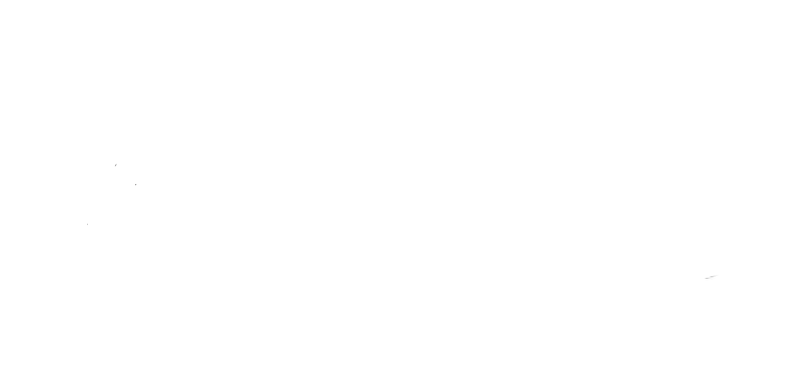
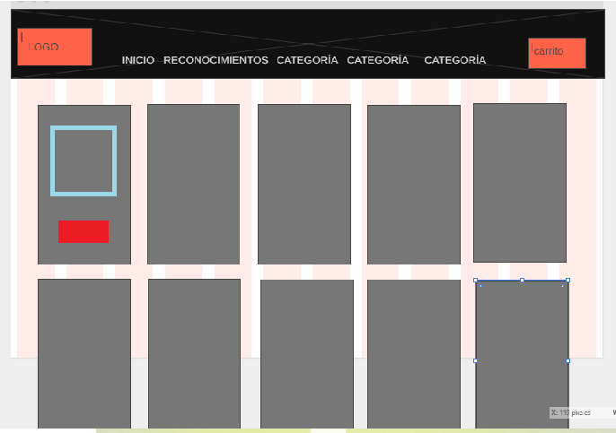

# Galeria de Arte ACAMACHON

<div align="center" style="height:360px;margin-bottom:32px;">
  <a >
    
  </a>
  <p><em>logo de galeria</em></p>
</div>

## Description

Desafio creando una app simulando un galeria de arte usando 
https://es.reactjs.org/

## Description video

<div align="center" style="height:360px;margin-bottom:40px;">
  <a href="../galeria/retrato4.jpg">
    
    <video>
    <source src="./imagenes/videoreact.mp4" type="video/mp4"/>
    </video>
  </a>
  <p><em>Application description video</em></p>
</div>

---

<div align="center" style="height:360px;margin-bottom:32px;">
  <a >
    
  </a>
  <p><em>boceto de diseño de pagina</em></p>
</div>

## Structure

```
├── 📁 acamachon
|  
├── 📁 imagens: fotos para readme.md
├── 📁 public: Folder to serve static files
├── 📂 src: se encuentran todos los componentes
|  ├── 📄 env.ts: Single entry point for all env  ├── 📄 index.ts: Generated types by GraphQL Codegen
|  |  └── 📁 components: GraphQL queries documents
|  |  |   └── 📁 firebase:usuario @gmail
|  |  |   |  └── 📁 conector
|  |  |   |  └── 📁 index
|  |  |   └── 📁 CartWidget
|  |  |   └── 📁 index
|  |  |   └── 📁 Item
|  |  |   └── 📁 ItemCount
|  |  |   └── 📁 ItemDetail
|  |  |   └── 📁 ItemDetailContainer
|  |  |   └── 📁 ItemList
|  |  |   └── 📁 ItemListContainer
|  |  |   └── 📁 Navbar
|  |  |   └── 📁 TextFormularios
|  |  └── 📁 contexts: 
|  |  └── 📁 galeria: fotos de la galeria
|  |  └── 📁 hooks: 
|  |  └── 📁 mock: products.jsn antes de usar firebase
|  |  └── 📁 pages: 
|  |  |   └── 📁 cart
|  |  |   └── 📁 categories
|  |  |   └── 📁 exposiciones
|  |  |   └── 📁 home
|  |  |   └── 📁 productDetail
|  |  |   └── 📁 Reconocimientos
|  |  |   └── 📁 Retratos
|  |  └── 📁 styles

```

## Running

### requirement to raise project
https://github.com/AlexCamachoN/promise-y-maps-.git

- Descargar Zip
- npm install


